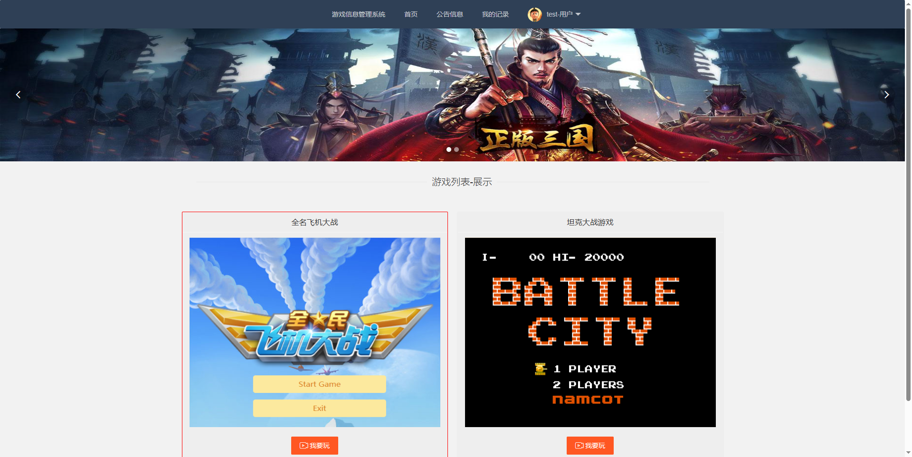
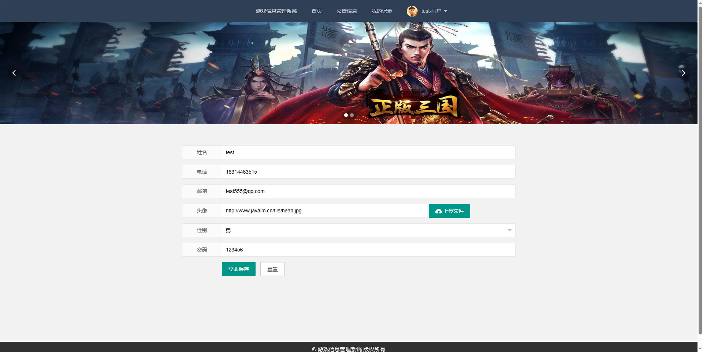
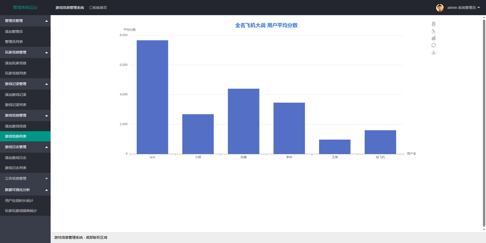
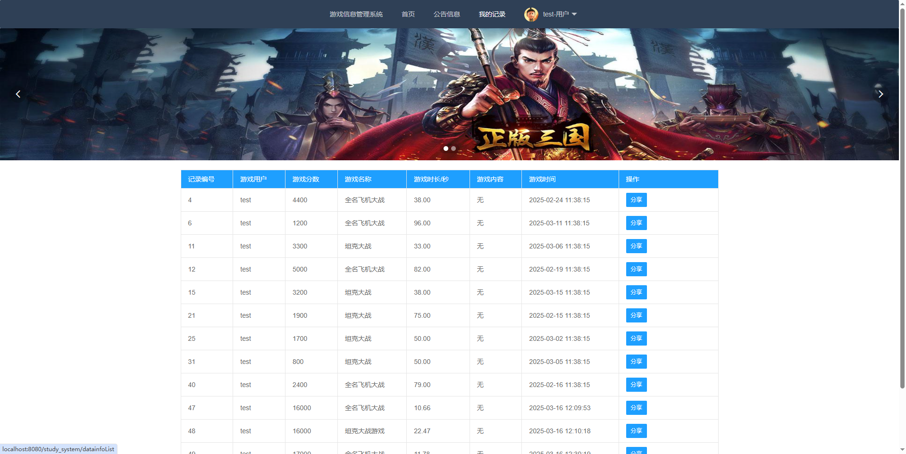
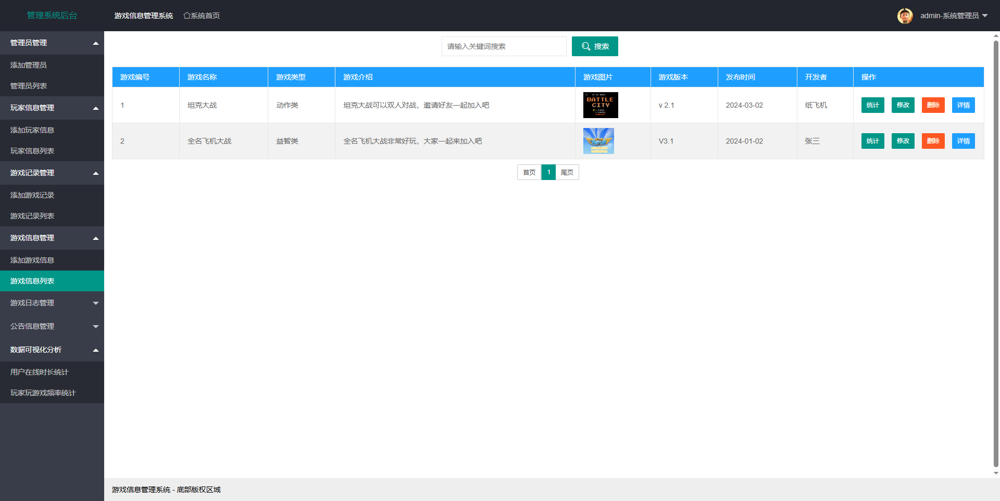
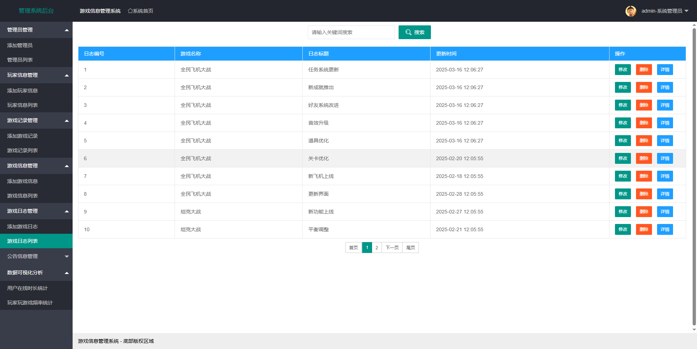
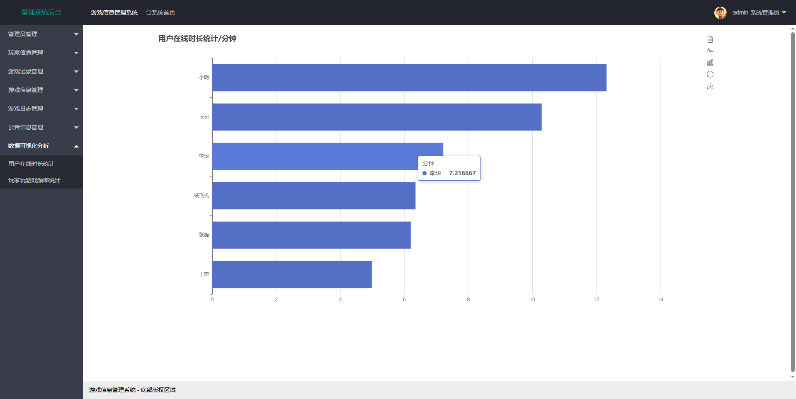
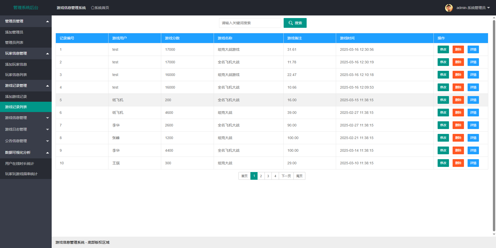
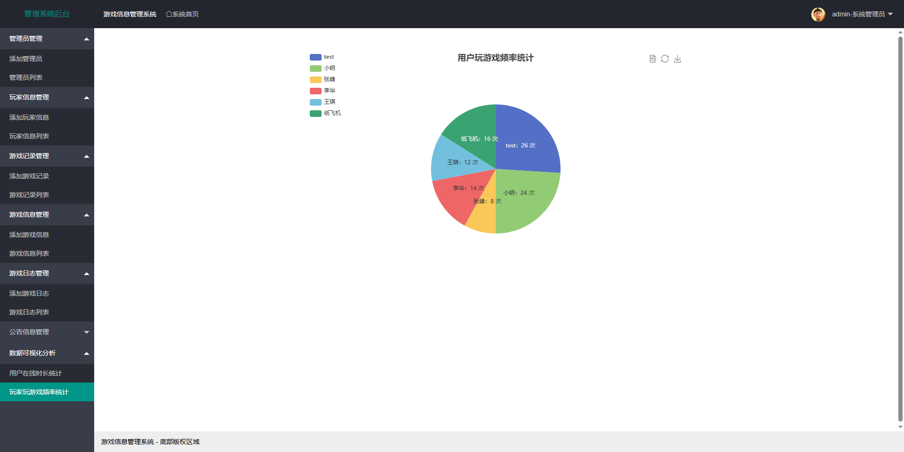
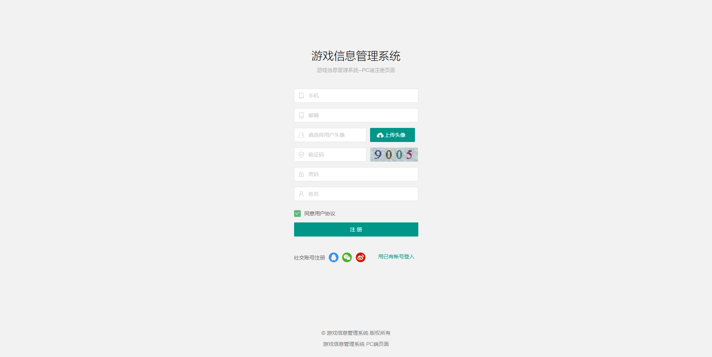

# game_information_management_system
在线游戏信息管理系统，支持玩家管理，玩家分析，游戏管理，游戏日志管理，在线玩游戏，成绩记录，Echarts可视化分。析

# B站演示视频地址   [https://www.bilibili.com/video/BV1SZ99Y3Egq/](https://www.bilibili.com/video/BV1uQQtYYEhH/)

## 基于Java的游戏信息管理系统 基于Web的游戏信息管理系统 网友游戏管理系统 在线小游戏管理系统 游戏网站源码

## 获取代码编号：2526

## 获取源码请加扣扣 1516993194  或者  2551449109

# 系统首页

# 个人中心

# 平均评分统计

# 我的游戏记录

# 游戏信息管理

# 游戏日志管理

# 玩家在线时长分析

# 玩家游戏记录

# 玩家玩游戏频率统计

# 用户注册

# 管理员登陆

【系统测试账号】
    管理员 admin 123456
    玩家 test 123456

【技术栈】
    开发语言：Java
    后端：Springboot + MybatisPlus + MySQL
    前端：html+css+js框架
    开发工具： idea + MySQL
【服务说明】
    1、【如果不会运行，可以找我们远程帮助调试运行】
    2、数据库每个表都有详细注释
    3、代码也有详细注释（详细说明）
    4、支持增减功能二次开发和定做

支持代码定做，修改，文档撰写

定做和代码二次修改说明:

①和客户沟通确定需求

②确定技术细节，核心功能

③定做好联系客户看效果,效果满意,远程帮助客户调试运行好

④项目定做提供的服务:

1.代码和测试数据

2.数据库说明文档

3.代码讲解视频

4.免费调试部署运行(没有运行软件我们帮安装)

5.售后答疑，服务到答辩结束为止

## 获取源码请加扣扣 1516993194  或者  2551449109
